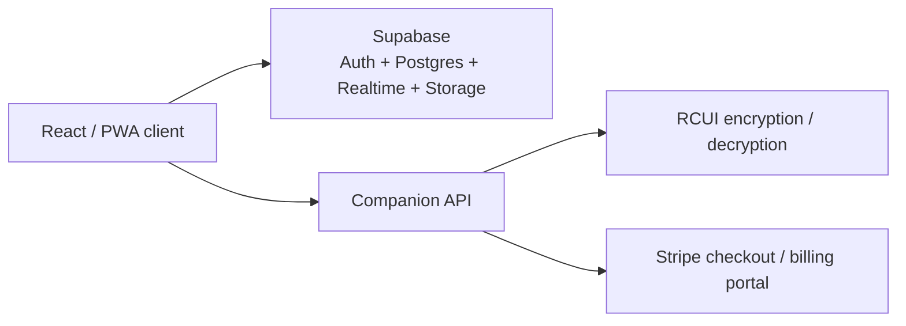

# Rust CUI Builder

> React + Vite application for building Rust CUI layouts visually.


> [!IMPORTANT]
> The repository contains a working client application. Billing, encryption, and some realtime features still depend on configured Supabase services and companion API routes.

## Overview

Rust CUI Builder is aimed at Rust server and plugin developers who want to design game UI layouts visually instead of hand-authoring every screen. The current repository includes:

- project management, previews, favorites, tags, drafts, and trash handling
- Supabase-backed auth, storage, realtime, and collaboration flows
- plan gating for Free, Solo, and Team subscriptions
- support tickets and notification workflows
- offline/PWA behavior with a service worker and queued saves
- `.rcui` export and import flows
- legal, share, admin, and desktop callback routes
- a working browser-based editor

## Quick Start

```bash
npm install
npm run dev
```

Production build:

```bash
npm run build
```

Optional environment variables:

- `VITE_SUPABASE_URL`
- `VITE_SUPABASE_ANON_KEY`
- `VITE_ENABLE_CLIENT_SECURITY=false` to disable the client security overlay in local development

## Project Status

| Area | Status |
| --- | --- |
| Authentication and onboarding | Working |
| Dashboard, favorites, tags, trash, previews | Working |
| Notifications and support tickets | Working with Supabase |
| Plans, billing UI, and Stripe handoff | UI present, backend required |
| Offline queue and service worker | Working |
| Desktop auth callback route | Working |
| Visual editor | Working locally and with cloud sync when configured |
| Admin, share, and legal routes | Working |
| Local Vite build | Working |

## Architecture



## Repository Layout

```text
Rust-CUI-Builder/
|- src/                 # application source
|- public/              # PWA icons, branding, and static files
|- assets/              # shared imported CSS assets
|- docs/                # project notes and audit
|- README.md
|- LICENSE
|- CHANGELOG.md
|- package.json
\- vite.config.js
```

## Feature Highlights

- Visual Rust CUI workflow with layered editing, previews, and export-ready metadata.
- Project organization with search, tagging, favorites, drafts, and trash states.
- Collaboration patterns with notifications, comments/share flows, and support tickets.
- `.rcui` import/export support for transfer and backup workflows.
- PWA shell with offline queue handling and reconnect sync behavior.
- In-app release history covering versions `1.0.0` through `1.5.0`.

## Environment and Companion Services

For full cloud functionality the client expects:

- `VITE_SUPABASE_URL`
- `VITE_SUPABASE_ANON_KEY`
- API routes for `/api/security/event`
- API routes for `/api/rcui/encrypt` and `/api/rcui/decrypt`
- API routes for `/api/stripe/create-checkout`, `/api/stripe/subscription/:id`, and `/api/stripe/portal`
- server-side encryption material for `.rcui` handling

An `.env.example` file is included for the client-side values referenced in source. Without them, the app still starts and keeps local editor state where fallback paths are implemented.

## Remaining Gaps

- Stripe, security logging, and encrypted `.rcui` flows still require backend routes.
- Supabase-backed features need real credentials plus matching tables and policies.
- Native desktop packaging is not included in this repository.

For a fuller breakdown, see [docs/PROJECT_AUDIT.md](docs/PROJECT_AUDIT.md).

## Changelog

The in-app release history is mirrored in [CHANGELOG.md](CHANGELOG.md).

## License

This repository currently ships under a proprietary source-available license.

See [LICENSE](LICENSE).
