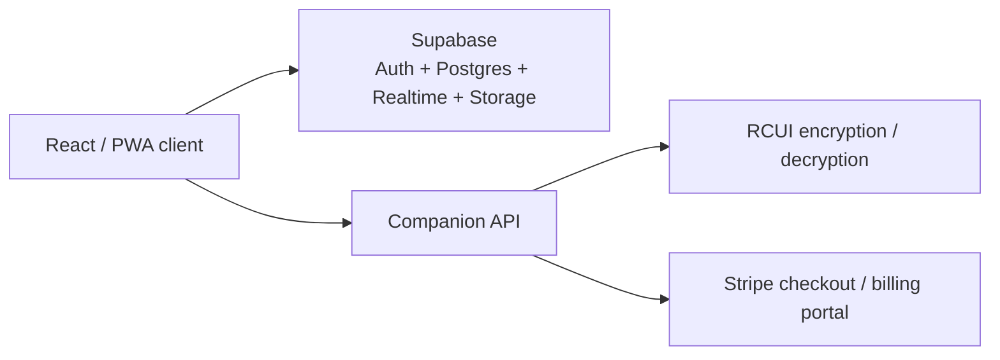

# Rust CUI Builder

> Archive recovery snapshot of a proprietary React + Supabase platform for designing Rust game-server CUI interfaces, managing projects, and exporting encrypted `.rcui` bundles.


> [!IMPORTANT]
> This repository currently contains an extracted RAR snapshot, not a full production checkout.
> The code inside `extracted/rustcuitoolbeta/` mixes a partial `src/` tree with prebuilt browser assets, and several files required for a clean local rebuild are missing.

## Overview

Rust CUI Builder is a commercial product aimed at Rust server and plugin developers who want to build game UI layouts visually instead of hand-authoring every screen. The recovered snapshot shows a feature-rich client that combines:

- visual project management and previews
- Supabase-backed auth, storage, realtime, and collaboration
- plan gating for Free, Solo, and Team subscriptions
- support tickets and notification workflows
- offline/PWA behavior with a service worker
- encrypted `.rcui` export and import flows
- Windows desktop integration hooks alongside the web app

## Snapshot Status

| Area | Status in this snapshot |
| --- | --- |
| Authentication and onboarding | Recovered source |
| Dashboard, favorites, tags, trash, previews | Recovered source |
| Notifications and support tickets | Recovered source |
| Plans, billing UI, and Stripe handoff | Recovered source |
| Offline queue and service worker | Recovered source |
| Desktop app hooks | Recovered source |
| Visual editor | Referenced, but source file is missing |
| Admin, share, legal, and desktop callback routes | Referenced, but source files are missing |
| Clean local rebuild | Blocked by missing package/build files |

## Architecture



## Repository Layout

```text
Rust-CUI-Builder/
|- README.md
|- LICENSE
|- CHANGELOG.md
|- .env.example
|- docs/
|  \- PROJECT_AUDIT.md
|- rustcuitoolbeta.rar
\- extracted/
   \- rustcuitoolbeta/
      |- assets/
      |- src/
      |- index.html
      |- manifest.json
      \- sw.js
```

## Key Product Capabilities Recovered

- Rust-focused visual UI workflow with project cards, previews, tags, favorites, drafts, and trash handling.
- Supabase auth flows for email/password, OTP, and OAuth-style sign-in handoff.
- Subscription-aware limits for projects, drafts, collaboration, assets, and version history.
- Team collaboration patterns with collaborators, notifications, presence tracking, and support tickets.
- Encrypted project export/import using the custom `.rcui` format.
- PWA/offline behavior with shell caching and deferred save queue support.
- In-app release history that traces the product from `1.0.0` to `1.5.0`.

## What Is Missing

This archive is useful, but it is not a clean source repository yet. The biggest gaps are:

- no `package.json`, lockfile, or Vite build configuration
- missing route modules such as `Editor.jsx`, `AdminDashboard.jsx`, `AdminRoute.jsx`, `ShareView.jsx`, `LegalPage.jsx`, and `DesktopAuthCallback.jsx`
- missing stylesheets such as `App.css`, `index.css`, `Auth.css`, `Dashboard.css`, `SettingsModal.css`, `Skeleton.css`, `Tickets.css`, and more
- `manifest.json` is not a valid web manifest in this snapshot; it is a captured Cloudflare challenge page
- companion backend endpoints and secrets are not included in this repository

For a fuller breakdown, see [docs/PROJECT_AUDIT.md](docs/PROJECT_AUDIT.md).

## Environment and Companion Services

The recovered client expects the following pieces around it:

- `VITE_SUPABASE_URL`
- `VITE_SUPABASE_ANON_KEY`
- API routes for `/api/security/event`
- API routes for `/api/rcui/encrypt` and `/api/rcui/decrypt`
- API routes for `/api/stripe/create-checkout`, `/api/stripe/subscription/:id`, and `/api/stripe/portal`
- server-side encryption material for `.rcui` handling

An `.env.example` file is included for the client-side values that appear in source.

## Changelog

The in-app release history has been extracted into [CHANGELOG.md](CHANGELOG.md).

## License

This repository is documented as proprietary source-available code owned by Hex Plugins, matching the ownership language embedded in the recovered application UI.

See [LICENSE](LICENSE).
