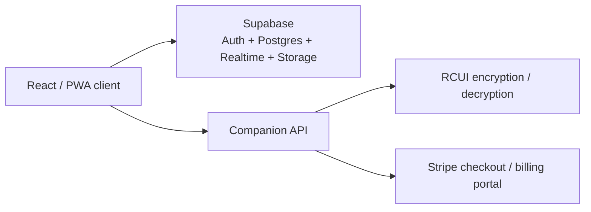

# Rust CUI Builder

> Recovered and runnable React + Vite app rebuilt from an archived Rust CUI Builder snapshot.


> [!IMPORTANT]
> The original archive is still preserved under `extracted/`, but the working application now lives in the repository root as a recovery build. Some cloud features still depend on Supabase and companion API routes.

## Overview

Rust CUI Builder is a commercial product aimed at Rust server and plugin developers who want to build game UI layouts visually instead of hand-authoring every screen. The recovered app in this repository now includes:

- visual project management and previews
- Supabase-backed auth, storage, realtime, and collaboration
- plan gating for Free, Solo, and Team subscriptions
- support tickets and notification workflows
- offline/PWA behavior with a service worker
- encrypted `.rcui` export and import flows
- Windows desktop integration hooks alongside the web app
- a rebuilt recovery editor route that is usable locally

## Quick Start

```bash
npm install
npm run dev
```

Production build:

```bash
npm run build
```

Optional environment variables:

- `VITE_SUPABASE_URL`
- `VITE_SUPABASE_ANON_KEY`
- `VITE_ENABLE_CLIENT_SECURITY=false` for local development if you want to force-disable the anti-devtools client code in production-like builds

## Snapshot Status

| Area | Status now |
| --- | --- |
| Authentication and onboarding | Working recovery build |
| Dashboard, favorites, tags, trash, previews | Working recovery build |
| Notifications and support tickets | Working recovery build |
| Plans, billing UI, and Stripe handoff | UI restored, backend still required |
| Offline queue and service worker | Working recovery build |
| Desktop app hooks | Route restored |
| Visual editor | Rebuilt recovery editor |
| Admin, share, legal, and desktop callback routes | Restored |
| Local Vite build | Working |

## Architecture



## Repository Layout

```text
Rust-CUI-Builder/
|- src/                 # working recovery app
|- public/              # rebuilt local branding + PWA assets
|- assets/              # recovered archived bundles and CSS
|- extracted/           # untouched archive snapshot
|- README.md
|- LICENSE
|- CHANGELOG.md
|- package.json
\- vite.config.js
```

## Key Product Capabilities Recovered

- Rust-focused visual UI workflow with project cards, previews, tags, favorites, drafts, and trash handling.
- Supabase auth flows for email/password, OTP, and OAuth-style sign-in handoff.
- Subscription-aware limits for projects, drafts, collaboration, assets, and version history.
- Team collaboration patterns with collaborators, notifications, presence tracking, and support tickets.
- Encrypted project export/import using the custom `.rcui` format.
- PWA/offline behavior with shell caching and deferred save queue support.
- In-app release history that traces the product from `1.0.0` to `1.5.0`.

## What Is Missing

This project is now runnable, but it is still a recovery build. The biggest remaining gaps are:

- the root app is reconstructed from an incomplete snapshot, so some behaviors are approximation rather than byte-for-byte recovery
- Stripe, security logging, and encrypted `.rcui` APIs still require backend routes
- Supabase-backed features still need real credentials and matching tables/policies
- the original archive inside `extracted/` still contains broken historical files such as the captured Cloudflare `manifest.json`

For a fuller breakdown, see [docs/PROJECT_AUDIT.md](docs/PROJECT_AUDIT.md).

## Environment and Companion Services

The rebuilt client expects the following pieces around it for full cloud functionality:

- `VITE_SUPABASE_URL`
- `VITE_SUPABASE_ANON_KEY`
- API routes for `/api/security/event`
- API routes for `/api/rcui/encrypt` and `/api/rcui/decrypt`
- API routes for `/api/stripe/create-checkout`, `/api/stripe/subscription/:id`, and `/api/stripe/portal`
- server-side encryption material for `.rcui` handling

An `.env.example` file is included for the client-side values that appear in source. Without them, the app still runs in local recovery mode and stores editor state locally where possible.

## Changelog

The in-app release history has been extracted into [CHANGELOG.md](CHANGELOG.md).

## License

This repository is documented as proprietary source-available code owned by Hex Plugins, matching the ownership language embedded in the recovered application UI.

See [LICENSE](LICENSE).
